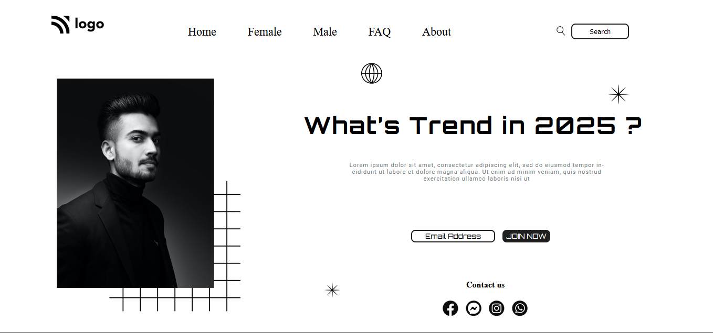

# Street Style Landing Page 

This is my first single page template project using HTMl & CSS. I haven't made it responsive yet, So it works only in laptop. Hope you like it.

## Live-Link -: [Street-Style](https://street-style-project.netlify.app/)

## Learnings from this project

- Learned about how to use selectors to add styles to them.
- Got good understanding of positions and how to use them.
- Learned about the property z-index that control the stacking order of elements on a web page along the z-axis.

## Time Taken to finish the project

I have not been tracking the time honestly but I guess it took me around 3.5 to 4 hours.
